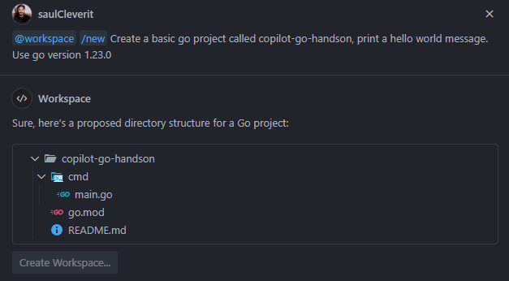

### 💻 Activity

Golang Development with GitHub Copilot

### 🎯 General Objective:

Demonstrate how GitHub Copilot enhances Go development by assisting in project creation, CSV file handling, function implementation, and testing, while providing a practical understanding of how AI-assisted coding can streamline and improve programming workflows.

### Specific Objectives:

- **Create a Go Project from Scratch Using GitHub Copilot**:
  Show how GitHub Copilot can assist in setting up a new Go project, generating boilerplate code, and structuring the project efficiently.

- **Read and Process CSV Files with GitHub Copilot**:
  Illustrate how GitHub Copilot helps in writing code to read and parse CSV files, making it easier to handle file I/O and data extraction.

- **Create a Function to Get the Sum of Balances in the CSV Using GitHub Copilot**:
  Demonstrate how Copilot aids in creating functions to process and aggregate data from CSV files, such as summing specific columns.

- **Export CSV with GitHub Copilot**:
  Show how Copilot assists in generating code for exporting processed data back into CSV format, simplifying file writing and formatting tasks.

- **Write and Execute Tests with GitHub Copilot**:
  Highlight how GitHub Copilot helps in writing unit tests to ensure code correctness, including generating test cases and using Go’s testing framework.

- **Export GitHub Copilot Chat**:
  Explain how to export chat logs from GitHub Copilot to review and understand the AI’s code suggestions and improvements, enhancing the learning process.

### Expected Outcomes

- **Enhanced Productivity**: You will have learned how to use GitHub Copilot to significantly improve your productivity in Go development, from setting up projects and writing code to handling files and testing.

- **Efficient CSV Handling**: You will be able to leverage GitHub Copilot to efficiently read, process, and export CSV files, demonstrating how AI can streamline data manipulation tasks.

- **Function Implementation**: You will understand how Copilot assists in creating and refining functions to process and aggregate data, such as summing values from CSV files.

- **Streamlined Testing and Exporting**: You will be able to use Copilot to write and execute unit tests and handle CSV export tasks, enhancing your ability to ensure code correctness and manage data output.

- **Insightful Documentation**: You will know how to export and analyze GitHub Copilot chat logs, gaining insights into the AI’s suggestions and improving your understanding of how Copilot supports your coding process.

### Step 1: Clone the repository

### Step 2: Create a GO project with GitHub Copilot

To start the activity we are going to ask to copilot chat to create a new Go project

👤 Prompt:

```
@workspace /new Create a basic go project called copilot-go-handson, print a hello world message. Use go version 1.23.0
```



### Step 3: Run go project

Ask to copilot how to run our project

👤 Prompt:

```
@workspace how to run my go project
```

🤖 Copilot Answer:

```cmd
go run ./cmd
```

### Step 4: Read CSV file

Ask to copilot how to create a function to read CSV file

👤 Prompt:

```
@workspace How to create a function to only read this csv #file:accounts.csv
```

🤖 Copilot Answer:

```go
package main

import (
    "encoding/csv"
    "fmt"
    "os"
)

func readCSV(filePath string) ([][]string, error) {
    file, err := os.Open(filePath)
    if err != nil {
        return nil, err
    }
    defer file.Close()

    reader := csv.NewReader(file)
    records, err := reader.ReadAll()
    if err != nil {
        return nil, err
    }

    return records, nil
}

func main() {
    records, err := readCSV("assets/accounts.csv")
    if err != nil {
        fmt.Println("Error:", err)
        return
    }

    for _, record := range records {
        fmt.Println(record)
    }
}
```

### Step 5: Specify columns types

Tell copilot, the types of the columns

👤 Prompt:

```
@workspace The csv has the following colums : Account ID: string AccountHolderName: string Balance: number Currency: string Type string createdAt: date
```

🤖 Copilot Answer:

```go
package main
import (
	"encoding/csv"
	"fmt"
	"os"
	"strconv"
	"time"
)
type Account struct {
	AccountID         string
	AccountHolderName string
	Balance           float64
	Currency          string
	Type              string
	CreatedAt         time.Time
}

func readCSV(filePath string) ([]Account, error) {
	file, err := os.Open(filePath)
	if err != nil {
		return nil, err
	}
	defer file.Close()

	reader := csv.NewReader(file)
	records, err := reader.ReadAll()
	if err != nil {
		return nil, err
	}

	var accounts []Account
	for _, record := range records[1:] { // Skip header row
		balance, err := strconv.ParseFloat(record[2], 64)
		if err != nil {
			return nil, err
		}
		createdAt, err := time.Parse("2006-01-02", record[5])
		if err != nil {
			return nil, err
		}
		account := Account{
			AccountID:         record[0],
			AccountHolderName: record[1],
			Balance:           balance,
			Currency:          record[3],
			Type:              record[4],
			CreatedAt:         createdAt,
		}
		accounts = append(accounts, account)
	}

	return accounts, nil
}

func main() {
	accounts, err := readCSV("assets/accounts.csv")
	if err != nil {
		fmt.Println("Error:", err)
		return
	}

	for _, account := range accounts {
		fmt.Printf("%+v\n", account)
	}
}
```

### Step 6: Create enums for currency and account type

> ℹ️ In Go there are no enums as such, in the style of other languages such as Java or C#. However, Go offers a way to achieve similar behavior by using constant types (consts) and the concept of user-defined types

Ask to copilot to create an enum for account type

👤 Prompt:

```
@workspace Define an AccountType enum as a string with two possible values: Checking and Savings
```

🤖 Copilot Answer:

```go
type AccountType string

const (
	Checking AccountType = "Checking"
	Saving   AccountType = "Saving"
)
```

```go
package main

import (
    "encoding/csv"
    "fmt"
    "os"
    "strconv"
    "time"
)

type AccountType string

const (
    Checking AccountType = "Checking"
    Savings  AccountType = "Savings"
)


type Account struct {
    AccountID         string
    AccountHolderName string
    Balance           float64
    Currency          string
    Type              AccountType
    CreatedAt         time.Time
}

func readCSV(filePath string) ([]Account, error) {
    file, err := os.Open(filePath)
    if err != nil {
        return nil, err
    }
    defer file.Close()

    reader := csv.NewReader(file)
    records, err := reader.ReadAll()
    if err != nil {
        return nil, err
    }

    var accounts []Account
    for _, record := range records[1:] { // Skip header row
        balance, err := strconv.ParseFloat(record[2], 64)
        if err != nil {
            return nil, err
        }
        createdAt, err := time.Parse("2006-01-02", record[5])
        if err != nil {
            return nil, err
        }
        account := Account{
            AccountID:         record[0],
            AccountHolderName: record[1],
            Balance:           balance,
            Currency:          record[3],
            Type:              AccountType(record[4]),
            CreatedAt:         createdAt,
        }
        accounts = append(accounts, account)
    }

    return accounts, nil
}

func main() {
    accounts, err := readCSV("assets/accounts.csv")
    if err != nil {
        fmt.Println("Error:", err)
        return
    }

    for _, account := range accounts {
        fmt.Printf("%+v\n", account)
    }
}
```

### Step 7: Create an enum for currency

Tell copilot to create an enum for currency, currency could be EUR or USD

👤Prompt:

```
@workspace Define an Currency enum as a string with two possible values: USD and EUR
```

🤖 Copilot Answer:

```go
type Currency string

const (
    USD Currency = "USD"
    EUR Currency = "EUR"
    GBP Currency = "GBP"
)
```

```go
package main

import (
    "encoding/csv"
    "fmt"
    "os"
    "strconv"
    "time"
)

type AccountType string

const (
    Checking AccountType = "Checking"
    Saving   AccountType = "Saving"
)

type Currency string

const (
    USD Currency = "USD"
    EUR Currency = "EUR"
    GBP Currency = "GBP"
)

type Account struct {
    AccountID         string
    AccountHolderName string
    Balance           float64
    Currency          Currency
    Type              AccountType
    CreatedAt         time.Time
}

func readCSV(filePath string) ([]Account, error) {
    file, err := os.Open(filePath)
    if err != nil {
        return nil, err
    }
    defer file.Close()

    reader := csv.NewReader(file)
    records, err := reader.ReadAll()
    if err != nil {
        return nil, err
    }

    var accounts []Account
    for _, record := range records[1:] { // Skip header row
        balance, err := strconv.ParseFloat(record[2], 64)
        if err != nil {
            return nil, err
        }
        createdAt, err := time.Parse("2006-01-02", record[5])
        if err != nil {
            return nil, err
        }
        account := Account{
            AccountID:         record[0],
            AccountHolderName: record[1],
            Balance:           balance,
            Currency:          Currency(record[3]),
            Type:              AccountType(record[4]),
            CreatedAt:         createdAt,
        }
        accounts = append(accounts, account)
    }

    return accounts, nil
}

func main() {
    accounts, err := readCSV("assets/accounts.csv")
    if err != nil {
        fmt.Println("Error:", err)
        return
    }

    for _, account := range accounts {
        fmt.Printf("%+v\n", account)
    }
}
```

### Step 8: Create a function to sum balances by year and currency

> ⚠️ GitHub Copilot will most likely give us somewhat different answers to the code we have in our README, but the result should be similar.

We want to sum the balances in the CSV file by year and by currency, to tell copilot to do it.

👤Prompt:

```
@workspace now create a function to get the sum of balances by year and by Currency
```

🤖 Copilot Answer:

```go
func sumBalancesByYearAndCurrency(accounts []Account) map[string]map[Currency]float64 {
	sums := make(map[string]map[Currency]float64)

	for _, account := range accounts {
		year := account.CreatedAt.Year()
		if _, ok := sums[strconv.Itoa(year)]; !ok {
			sums[strconv.Itoa(year)] = make(map[Currency]float64)
		}
		sums[strconv.Itoa(year)][account.Currency] += account.Balance
	}

	return sums
}
```

### Step 9: Export a csv with the result of the sum balances by year and currency

We want to export the result of the sum of balances by year and currency, tell copilot to explain how to do it

👤Prompt:

```
now I want to export in a new csv the result of the sum of balances by year and currency, the csv must be exported in the assets directory
```

🤖 Copilot Answer:

```go
func writeCSV(filePath string, sums map[string]map[Currency]float64) error {
	file, err := os.Create(filePath)
	if err != nil {
		return err
	}
	defer file.Close()

	writer := csv.NewWriter(file)
	defer writer.Flush()

	// Write header
	writer.Write([]string{"Year", "Currency", "Sum of Balances"})

	// Write data
	for year, currencySums := range sums {
		for currency, sum := range currencySums {
			record := []string{year, string(currency), fmt.Sprintf("%.2f", sum)}
			writer.Write(record)
		}
	}

	return nil
}
```

### Step 10: Add Tests

> ⚠️ GitHub Copilot will most likely give us somewhat different answers to the code we have in our README, but the result should be similar.

Ask to copilot to generate test for the function to sum balances. Select the function and use the selection in the copilot chat.

👤Prompt:

```
@workspace now how to add unit tests for #selection
```

🤖 Copilot Answer:

```go
func TestSumBalancesByYearAndCurrency(t *testing.T) {
	// Create sample data
	accounts := []Account{
		{AccountID: "1", AccountHolderName: "John Doe", Balance: 1000.50, Currency: USD, Type: Checking, CreatedAt: time.Date(2022, 1, 1, 0, 0, 0, 0, time.UTC)},
		{AccountID: "2", AccountHolderName: "Jane Smith", Balance: 2000.75, Currency: EUR, Type: Saving, CreatedAt: time.Date(2021, 6, 15, 0, 0, 0, 0, time.UTC)},
		{AccountID: "3", AccountHolderName: "Alice Brown", Balance: 1500.00, Currency: USD, Type: Saving, CreatedAt: time.Date(2022, 3, 10, 0, 0, 0, 0, time.UTC)},
	}

	// Call sumBalancesByYearAndCurrency
	sums := sumBalancesByYearAndCurrency(accounts)

	// Verify the returned data
	expected := map[string]map[Currency]float64{
		"2021": {EUR: 2000.75},
		"2022": {USD: 2500.50},
	}
	if !reflect.DeepEqual(sums, expected) {
		t.Errorf("Expected %v, got %v", expected, sums)
	}
}
```

Now we want to test all the main file. Tell copilot to do it.

👤Prompt:

```
@workspace /tests Generate unit tests for every function the file #file:main.go
```

🤖 Copilot Answer:

```go
package main

import (
	"os"
	"reflect"
	"sort"
	"strings"
	"testing"
	"time"
)

func TestReadCSV(t *testing.T) {
	// Create a temporary CSV file
	file, err := os.CreateTemp("", "accounts*.csv")
	if err != nil {
		t.Fatal(err)
	}
	defer os.Remove(file.Name())

	// Write sample data to the file
	data := `AccountID,AccountHolderName,Balance,Currency,Type,CreatedAt
1,John Doe,1000.50,USD,Checking,2022-01-01
2,Jane Smith,2000.75,EUR,Saving,2021-06-15`
	if _, err := file.Write([]byte(data)); err != nil {
		t.Fatal(err)
	}
	file.Close()

	// Call readCSV
	accounts, err := readCSV(file.Name())
	if err != nil {
		t.Fatal(err)
	}

	// Verify the returned data
	expected := []Account{
		{AccountID: "1", AccountHolderName: "John Doe", Balance: 1000.50, Currency: USD, Type: Checking, CreatedAt: time.Date(2022, 1, 1, 0, 0, 0, 0, time.UTC)},
		{AccountID: "2", AccountHolderName: "Jane Smith", Balance: 2000.75, Currency: EUR, Type: Saving, CreatedAt: time.Date(2021, 6, 15, 0, 0, 0, 0, time.UTC)},
	}
	if !reflect.DeepEqual(accounts, expected) {
		t.Errorf("Expected %v, got %v", expected, accounts)
	}
}

func TestSumBalancesByYearAndCurrency(t *testing.T) {
	// Create sample data
	accounts := []Account{
		{AccountID: "1", AccountHolderName: "John Doe", Balance: 1000.50, Currency: USD, Type: Checking, CreatedAt: time.Date(2022, 1, 1, 0, 0, 0, 0, time.UTC)},
		{AccountID: "2", AccountHolderName: "Jane Smith", Balance: 2000.75, Currency: EUR, Type: Saving, CreatedAt: time.Date(2021, 6, 15, 0, 0, 0, 0, time.UTC)},
		{AccountID: "3", AccountHolderName: "Alice Brown", Balance: 1500.00, Currency: USD, Type: Saving, CreatedAt: time.Date(2022, 3, 10, 0, 0, 0, 0, time.UTC)},
	}

	// Call sumBalancesByYearAndCurrency
	sums := sumBalancesByYearAndCurrency(accounts)

	// Verify the returned data
	expected := map[string]map[Currency]float64{
		"2021": {EUR: 2000.75},
		"2022": {USD: 2500.50},
	}
	if !reflect.DeepEqual(sums, expected) {
		t.Errorf("Expected %v, got %v", expected, sums)
	}
}

func TestWriteCSV(t *testing.T) {
	// Create a temporary file
	file, err := os.CreateTemp("", "sums*.csv")
	if err != nil {
		t.Fatal(err)
	}
	defer os.Remove(file.Name())

	// Create sample data
	sums := map[string]map[Currency]float64{
		"2021": {EUR: 2000.75},
		"2022": {USD: 2500.50},
	}

	// Call writeCSV
	if err := writeCSV(file.Name(), sums); err != nil {
		t.Fatal(err)
	}

	// Read the file and verify its contents
	content, err := os.ReadFile(file.Name())
	if err != nil {
		t.Fatal(err)
	}

	expected := `Year,Currency,Sum of Balances
2021,EUR,2000.75
2022,USD,2500.50
`

	// Sort the lines before comparing
	expectedLines := strings.Split(expected, "\n")
	actualLines := strings.Split(string(content), "\n")
	sort.Strings(expectedLines)
	sort.Strings(actualLines)

	if !reflect.DeepEqual(expectedLines, actualLines) {
		t.Errorf("Expected %v, got %v", expectedLines, actualLines)
	}
}


```

> ❗ In case of copilot didn't suggest how to run the test file, ask to Copilot how to do it.

👤Prompt:

```
@workspace how to run tests
```

🤖 Copilot Answer:

```bash
go test ./cmd
```

### Step 11: Add Cron Job to export csv

Tell to GitHub Copilot that you want to implement cron jobs to export the csv

👤Prompt:

```
@workspace now I would like to implement cron jobs to export the csv every 1 min, how can we do it ?
```

🤖 Copilot Answer:

To implement cron jobs to export the CSV every 1 minute, you can use the github.com/robfig/cron/v3 package.
Here's how you can do it:

1. Install the cron package:

```bash
go get github.com/robfig/cron/v3
```

2. Update your main.go file to include the cron job setup:

```go
func exportCSV() {
    accounts, err := readCSV("assets/accounts.csv")
    if err != nil {
        fmt.Println("Error:", err)
        return
    }

    sums := sumBalancesByYearAndCurrency(accounts)

    err = writeCSV("assets/sum_balances.csv", sums)
    if err != nil {
        fmt.Println("Error:", err)
        return
    }

    fmt.Println("CSV file created successfully.")
}
```

```go
func main() {
    c := cron.New()
    c.AddFunc("@every 1m", exportCSV)
    c.Start()

    // Keep the program running
    select {}
}
```

```bash
go run main.go
```

### Step 11: Export Copilot Chat

Exporting GitHub Copilot chat enables you to document and review interactions for future reference, share insights with team members, and track decision-making processes, enhancing collaboration, learning, and code quality.

To export the copilot chat, press `Ctrl + Shift + P` and type 'Export Chat'
