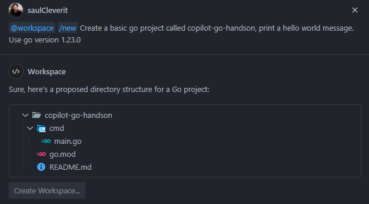

### 💻 Actividad

Desarrollo de Golang con GitHub Copilot

### 🎯 Objetivo General:

Demostrar cómo GitHub Copilot mejora el desarrollo en Go al asistir en la creación de proyectos, manejo de archivos CSV, implementación de funciones y pruebas, proporcionando una comprensión práctica de cómo la codificación asistida por IA puede agilizar y mejorar los flujos de trabajo de programación.

### Objetivos Específicos:

- **Crear un Proyecto Go desde Cero Usando GitHub Copilot**:
  Mostrar cómo GitHub Copilot puede ayudar a configurar un nuevo proyecto Go, generando código boilerplate y estructurando el proyecto de manera eficiente.

- **Leer y Procesar Archivos CSV con GitHub Copilot**:
  Ilustrar cómo GitHub Copilot ayuda a escribir código para leer y analizar archivos CSV, facilitando el manejo de E/S de archivos y la extracción de datos.

- **Crear una Función para Obtener la Suma de Saldos en el CSV Usando GitHub Copilot**:
  Demostrar cómo Copilot ayuda a crear funciones para procesar y agregar datos de archivos CSV, como sumar columnas específicas.

- **Exportar CSV con GitHub Copilot**:
  Mostrar cómo Copilot ayuda a generar código para exportar datos procesados de nuevo en formato CSV, simplificando las tareas de escritura y formato de archivos.

- **Escribir y Ejecutar Pruebas con GitHub Copilot**:
  Resaltar cómo GitHub Copilot ayuda a escribir pruebas unitarias para asegurar la corrección del código, incluyendo la generación de casos de prueba y el uso del marco de pruebas de Go.

- **Exportar Chat de GitHub Copilot**:
  Explicar cómo exportar registros de chat de GitHub Copilot para revisar y entender las sugerencias y mejoras de código de la IA, mejorando el proceso de aprendizaje.

### Resultados Esperados

- **Productividad Mejorada**: Habrás aprendido cómo usar GitHub Copilot para mejorar significativamente tu productividad en el desarrollo en Go, desde la configuración de proyectos y escritura de código hasta el manejo de archivos y pruebas.

- **Manejo Eficiente de CSV**: Serás capaz de aprovechar GitHub Copilot para leer, procesar y exportar archivos CSV de manera eficiente, demostrando cómo la IA puede agilizar las tareas de manipulación de datos.

- **Implementación de Funciones**: Entenderás cómo Copilot ayuda a crear y refinar funciones para procesar y agregar datos, como sumar valores de archivos CSV.

- **Pruebas y Exportación Simplificadas**: Serás capaz de usar Copilot para escribir y ejecutar pruebas unitarias y manejar tareas de exportación de CSV, mejorando tu capacidad para asegurar la corrección del código y gestionar la salida de datos.

- **Documentación Informativa**: Sabrás cómo exportar y analizar registros de chat de GitHub Copilot, obteniendo información sobre las sugerencias de la IA y mejorando tu comprensión de cómo Copilot apoya tu proceso de codificación.

### Antes de comenzar la actividad: Clona el repositorio.

### Paso 1: Crear un proyecto GO con GitHub Copilot

Para comenzar la actividad vamos a pedirle al chat de copilot que cree un nuevo proyecto Go

👤 Prompt:

```
@workspace /new Crea un proyecto básico de go llamado copilot-go-handson, imprime un mensaje de hola mundo. Usa la versión 1.23.0 de go y la carpeta cmd.
```



Selecciona la carpeta donde clonaste el repositorio y luego navega a la carpeta `copilot-go-handson`

Pregunta a copilot cómo ejecutar nuestro proyecto

👤 Prompt:

```
@workspace cómo ejecutar mi proyecto go
```

🤖 Respuesta de Copilot:

```cmd
go run ./cmd
```

### Paso 2: Leer archivo CSV

Pregunta a copilot cómo crear una función para leer un archivo CSV

👤 Prompt:

```
@workspace Cómo crear una función para solo leer este csv #file:accounts.csv
```

🤖 Respuesta de Copilot:

```go
package main

import (
    "encoding/csv"
    "fmt"
    "os"
)

func readCSV(filePath string) ([][]string, error) {
    file, err := os.Open(filePath)
    if err != nil {
        return nil, err
    }
    defer file.Close()

    reader := csv.NewReader(file)
    records, err := reader.ReadAll()
    if err != nil {
        return nil, err
    }

    return records, nil
}

func main() {
    records, err := readCSV("assets/accounts.csv")
    if err != nil {
        fmt.Println("Error:", err)
        return
    }

    for _, record := range records {
        fmt.Println(record)
    }
}
```

⚠️ En la línea de código con:

```go
 records, err := readCSV("assets/accounts.csv")
```

Por favor asegúrate de especificar la ruta correcta al archivo accounts.csv

### Paso 3: Especificar tipos de columnas

Dile a copilot los tipos de las columnas

👤 Prompt:

```
@workspace El csv tiene las siguientes columnas: Account ID: string AccountHolderName: string Balance: number Currency: string Type: string createdAt: date
```

🤖 Respuesta de Copilot:

```go
package main
import (
    "encoding/csv"
    "fmt"
    "os"
    "strconv"
    "time"
)
type Account struct {
    AccountID         string
    AccountHolderName string
    Balance           float64
    Currency          string
    Type              string
    CreatedAt         time.Time
}

func readCSV(filePath string) ([]Account, error) {
    file, err := os.Open(filePath)
    if err != nil {
        return nil, err
    }
    defer file.Close()

    reader := csv.NewReader(file)
    records, err := reader.ReadAll()
    if err != nil {
        return nil, err
    }

    var accounts []Account
    for _, record := range records[1:] { // Skip header row
        balance, err := strconv.ParseFloat(record[2], 64)
        if err != nil {
            return nil, err
        }
        createdAt, err := time.Parse("2006-01-02", record[5])
        if err != nil {
            return nil, err
        }
        account := Account{
            AccountID:         record[0],
            AccountHolderName: record[1],
            Balance:           balance,
            Currency:          record[3],
            Type:              record[4],
            CreatedAt:         createdAt,
        }
        accounts = append(accounts, account)
    }

    return accounts, nil
}

func main() {
    accounts, err := readCSV("assets/accounts.csv")
    if err != nil {
        fmt.Println("Error:", err)
        return
    }

    for _, account := range accounts {
        fmt.Printf("%+v\n", account)
    }
}
```

### Paso 4: Crear enums para el tipo de cuenta

> ℹ️ En Go no existen enums como tal, al estilo de otros lenguajes como Java o C#. Sin embargo, Go ofrece una manera de lograr un comportamiento similar utilizando tipos constantes (consts) y el concepto de tipos definidos por el usuario.

Pregunta a copilot para crear un enum para el tipo de cuenta

👤 Prompt:

```
@workspace Define un enum AccountType como una cadena con dos valores posibles: Checking y Savings
```

🤖 Respuesta de Copilot:

```go
type AccountType string

const (
    Checking AccountType = "Checking"
    Savings   AccountType = "Savings"
)
```

```go
package main

import (
    "encoding/csv"
    "fmt"
    "os"
    "strconv"
    "time"
)

type AccountType string

const (
    Checking AccountType = "Checking"
    Savings  AccountType = "Savings"
)


type Account struct {
    AccountID         string
    AccountHolderName string
    Balance           float64
    Currency          string
    Type              AccountType
    CreatedAt         time.Time
}

func readCSV(filePath string) ([]Account, error) {
    file, err := os.Open(filePath)
    if err != nil {
        return nil, err
    }
    defer file.Close()

    reader := csv.NewReader(file)
    records, err := reader.ReadAll()
    if err != nil {
        return nil, err
    }

    var accounts []Account
    for _, record := range records[1:] { // Skip header row
        balance, err := strconv.ParseFloat(record[2], 64)
        if err != nil {
            return nil, err
        }
        createdAt, err := time.Parse("2006-01-02", record[5])
        if err != nil {
            return nil, err
        }
        account := Account{
            AccountID:         record[0],
            AccountHolderName: record[1],
            Balance:           balance,
            Currency:          record[3],
            Type:              AccountType(record[4]),
            CreatedAt:         createdAt,
        }
        accounts = append(accounts, account)
    }

    return accounts, nil
}

func main() {
    accounts, err := readCSV("assets/accounts.csv")
    if err != nil {
        fmt.Println("Error:", err)
        return
    }

    for _, account := range accounts {
        fmt.Printf("%+v\n", account)
    }
}
```

### Paso 5: Crear un enum para currency

Dile a copilot que cree un enum para currency,podría ser EUR o USD

👤Prompt:

```
@workspace Define un enum Currency como una cadena con dos valores posibles: USD y EUR
```

🤖 Respuesta de Copilot:

```go
type Currency string

const (
    USD Currency = "USD"
    EUR Currency = "EUR"
)
```

```go
package main

import (
    "encoding/csv"
    "fmt"
    "os"
    "strconv"
    "time"
)

type AccountType string

const (
    Checking AccountType = "Checking"
    Savings   AccountType = "Savings"
)

type Currency string

const (
    USD Currency = "USD"
    EUR Currency = "EUR"
)

type Account struct {
    AccountID         string
    AccountHolderName string
    Balance           float64
    Currency          Currency
    Type              AccountType
    CreatedAt         time.Time
}

func readCSV(filePath string) ([]Account, error) {
    file, err := os.Open(filePath)
    if err != nil {
        return nil, err
    }
    defer file.Close()

    reader := csv.NewReader(file)
    records, err := reader.ReadAll()
    if err != nil {
        return nil, err
    }

    var accounts []Account
    for _, record := range records[1:] { // Skip header row
        balance, err := strconv.ParseFloat(record[2], 64)
        if err != nil {
            return nil, err
        }
        createdAt, err := time.Parse("2006-01-02", record[5])
        if err != nil {
            return nil, err
        }
        account := Account{
            AccountID:         record[0],
            AccountHolderName: record[1],
            Balance:           balance,
            Currency:          Currency(record[3]),
            Type:              AccountType(record[4]),
            CreatedAt:         createdAt,
        }
        accounts = append(accounts, account)
    }

    return accounts, nil
}

func main() {
    accounts, err := readCSV("assets/accounts.csv")
    if err != nil {
        fmt.Println("Error:", err)
        return
    }

    for _, account := range accounts {
        fmt.Printf("%+v\n", account)
    }
}
```

### Paso 6: Crear una función para sumar saldos por año y moneda

> ⚠️ GitHub Copilot probablemente nos dará respuestas algo diferentes al código que tenemos en nuestro README, pero el resultado debería ser similar.

Queremos sumar los saldos en el archivo CSV por año y por moneda, solicitemos esto a Copilot.

👤Prompt:

```
@workspace ahora crea una función para obtener la suma de saldos por año y por moneda
```

🤖 Respuesta de Copilot:

```go
func sumBalancesByYearAndCurrency(accounts []Account) map[string]map[Currency]float64 {
    sums := make(map[string]map[Currency]float64)

    for _, account := range accounts {
        year := account.CreatedAt.Year()
        if _, ok := sums[strconv.Itoa(year)]; !ok {
            sums[strconv.Itoa(year)] = make(map[Currency]float64)
        }
        sums[strconv.Itoa(year)][account.Currency] += account.Balance
    }

    return sums
}
```

### Paso 7: Exportar un csv con el resultado de la suma de saldos por año y moneda

Queremos exportar el resultado de la suma de saldos por año y por moneda, dile a copilot que explique cómo hacerlo

👤Prompt:

```
@workspace ahora quiero exportar en un nuevo csv el resultado de la suma de saldos por año y por moneda, el csv debe ser exportado en el directorio assets
```

🤖 Respuesta de Copilot:

```go
func writeCSV(filePath string, sums map[string]map[Currency]float64) error {
    file, err := os.Create(filePath)
    if err != nil {
        return err
    }
    defer file.Close()

    writer := csv.NewWriter(file)
    defer writer.Flush()

    // Write header
    writer.Write([]string{"Year", "Currency", "Sum of Balances"})

    // Write data
    for year, currencySums := range sums {
        for currency, sum := range currencySums {
            record := []string{year, string(currency), fmt.Sprintf("%.2f", sum)}
            writer.Write(record)
        }
    }

    return nil
}
```

### Paso 8: Agregar Pruebas

> ⚠️ GitHub Copilot probablemente nos dará respuestas algo diferentes al código que tenemos en nuestro README, pero el resultado debería ser similar.

Pregunta a copilot para generar pruebas para la función de sumar saldos. Selecciona la función y usa la selección en el chat de copilot.

👤Prompt:

```
@workspace cómo agregar pruebas unitarias para #selection
```

🤖 Respuesta de Copilot:

```go
func TestSumBalancesByYearAndCurrency(t *testing.T) {
    // Create sample data
    accounts := []Account{
        {AccountID: "1", AccountHolderName: "John Doe", Balance: 1000.50, Currency: USD, Type: Checking, CreatedAt: time.Date(2022, 1, 1, 0, 0, 0, 0, time.UTC)},
        {AccountID: "2", AccountHolderName: "Jane Smith", Balance: 2000.75, Currency: EUR, Type: Savings, CreatedAt: time.Date(2021, 6, 15, 0, 0, 0, 0, time.UTC)},
        {AccountID: "3", AccountHolderName: "Alice Brown", Balance: 1500.00, Currency: USD, Type: Savings, CreatedAt: time.Date(2022, 3, 10, 0, 0, 0, 0, time.UTC)},
    }

    // Call sumBalancesByYearAndCurrency
    sums := sumBalancesByYearAndCurrency(accounts)

    // Verify the returned data
    expected := map[string]map[Currency]float64{
        "2021": {EUR: 2000.75},
        "2022": {USD: 2500.50},
    }
    if !reflect.DeepEqual(sums, expected) {
        t.Errorf("Expected %v, got %v", expected, sums)
    }
}
```

Ahora queremos probar todo el archivo principal. Dile a copilot que lo haga.

👤Prompt:

```
@workspace /tests Genera pruebas unitarias para cada función del archivo #file:main.go
```

🤖 Respuesta de Copilot:

```go
package main

import (
    "os"
    "reflect"
    "sort"
    "strings"
    "testing"
    "time"
)

func TestReadCSV(t *testing.T) {
    // Create a temporary CSV file
    file, err := os.CreateTemp("", "accounts*.csv")
    if err != nil {
        t.Fatal(err)
    }
    defer os.Remove(file.Name())

    // Write sample data to the file
    data := `AccountID,AccountHolderName,Balance,Currency,Type,CreatedAt
1,John Doe,1000.50,USD,Checking,2022-01-01
2,Jane Smith,2000.75,EUR,Savings,2021-06-15`
    if _, err := file.Write([]byte(data)); err != nil {
        t.Fatal(err)
    }
    file.Close()

    // Call readCSV
    accounts, err := readCSV(file.Name())
    if err != nil {
        t.Fatal(err)
    }

    // Verify the returned data
    expected := []Account{
        {AccountID: "1", AccountHolderName: "John Doe", Balance: 1000.50, Currency: USD, Type: Checking, CreatedAt: time.Date(2022, 1, 1, 0, 0, 0, 0, time.UTC)},
        {AccountID: "2", AccountHolderName: "Jane Smith", Balance: 2000.75, Currency: EUR, Type: Savings, CreatedAt: time.Date(2021, 6, 15, 0, 0, 0, 0, time.UTC)},
    }
    if !reflect.DeepEqual(accounts, expected) {
        t.Errorf("Expected %v, got %v", expected, accounts)
    }
}

func TestSumBalancesByYearAndCurrency(t *testing.T) {
    // Create sample data
    accounts := []Account{
        {AccountID: "1", AccountHolderName: "John Doe", Balance: 1000.50, Currency: USD, Type: Checking, CreatedAt: time.Date(2022, 1, 1, 0, 0, 0, 0, time.UTC)},
        {AccountID: "2", AccountHolderName: "Jane Smith", Balance: 2000.75, Currency: EUR, Type: Savings, CreatedAt: time.Date(2021, 6, 15, 0, 0, 0, 0, time.UTC)},
        {AccountID: "3", AccountHolderName: "Alice Brown", Balance: 1500.00, Currency: USD, Type: Savings, CreatedAt: time.Date(2022, 3, 10, 0, 0, 0, 0, time.UTC)},
    }

    // Call sumBalancesByYearAndCurrency
    sums := sumBalancesByYearAndCurrency(accounts)

    // Verify the returned data
    expected := map[string]map[Currency]float64{
        "2021": {EUR: 2000.75},
        "2022": {USD: 2500.50},
    }
    if !reflect.DeepEqual(sums, expected) {
        t.Errorf("Expected %v, got %v", expected, sums)
    }
}

func TestWriteCSV(t *testing.T) {
    // Create a temporary file
    file, err := os.CreateTemp("", "sums*.csv")
    if err != nil {
        t.Fatal(err)
    }
    defer os.Remove(file.Name())

    // Create sample data
    sums := map[string]map[Currency]float64{
        "2021": {EUR: 2000.75},
        "2022": {USD: 2500.50},
    }

    // Call writeCSV
    if err := writeCSV(file.Name(), sums); err != nil {
        t.Fatal(err)
    }

    // Read the file and verify its contents
    content, err := os.ReadFile(file.Name())
    if err != nil {
        t.Fatal(err)
    }

    expected := `Year,Currency,Sum of Balances
2021,EUR,2000.75
2022,USD,2500.50
`

    // Sort the lines before comparing
    expectedLines := strings.Split(expected, "\n")
    actualLines := strings.Split(string(content), "\n")
    sort.Strings(expectedLines)
    sort.Strings(actualLines)

    if !reflect.DeepEqual(expectedLines, actualLines) {
        t.Errorf("Expected %v, got %v", expectedLines, actualLines)
    }
}


```

> ❗ En caso de que copilot no sugiera cómo ejecutar el archivo de prueba, pregúntale a Copilot cómo hacerlo.

👤Prompt:

```
@workspace cómo ejecutar pruebas
```

🤖 Respuesta de Copilot:

```bash
go test ./cmd
```

### Paso 9: Agregar Cron Job para exportar csv

Dile a GitHub Copilot que quieres implementar cron jobs para exportar el csv

👤Prompt:

```
@workspace ahora me gustaría implementar cron jobs para exportar el csv cada 1 min, ¿cómo podemos hacerlo?
```

🤖 Respuesta de Copilot:

Para implementar cron jobs para exportar el CSV cada 1 minuto, puedes usar el paquete github.com/robfig/cron/v3.
Así es como puedes hacerlo:

1. Instala el paquete cron:

```bash
go get github.com/robfig/cron/v3
```

2. Actualiza tu archivo main.go para incluir la configuración del cron job:

```go
func exportCSV() {
    accounts, err := readCSV("assets/accounts.csv")
    if err != nil {
        fmt.Println("Error:", err)
        return
    }

    sums := sumBalancesByYearAndCurrency(accounts)

    err = writeCSV("assets/sum_balances.csv", sums)
    if err != nil {
        fmt.Println("Error:", err)
        return
    }

    fmt.Println("CSV file created successfully.")
}
```

```go
func main() {
    c := cron.New()
    c.AddFunc("@every 1m", exportCSV)
    c.Start()

    // Keep the program running
    select {}
}
```

```bash
go run main.go
```

### Paso 10: Exportar Chat de Copilot

Exportar el chat de GitHub Copilot te permite documentar y revisar interacciones para referencia futura, compartir ideas con los miembros del equipo y rastrear procesos de toma de decisiones, mejorando la colaboración, el aprendizaje y la calidad del código.

Para exportar el chat de copilot, presiona `Ctrl + Shift + P` y escribe 'Export Chat'
